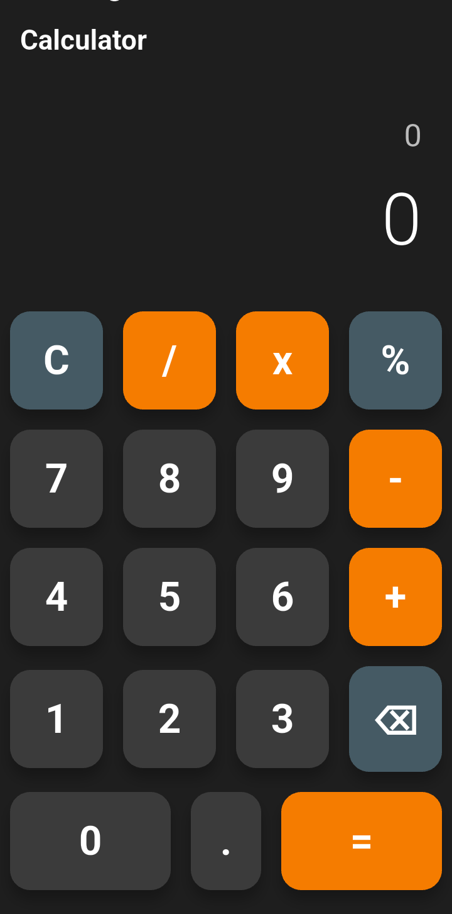

# 🧮 Flutter Calculator App

A simple and clean calculator app built using **Flutter**.  
Supports basic arithmetic operations with a modern UI.

---

## ✨ Features
- ➕ Addition, ➖ Subtraction, ✖️ Multiplication, ➗ Division
- 🖥️ Responsive and adaptive UI for Android & iOS
- 🎨 Clean design with Material styling
- ⚡ Fast performance with Flutter framework

## 🛠️ Tech Stack
- **Framework:** Flutter
- **Language:** Dart
- **IDE:** Android Studio / VS Code

---

## 🚀 Getting Started

### Prerequisites
- Install [Flutter SDK](https://flutter.dev/docs/get-started/install)
- Install [Android Studio](https://developer.android.com/studio) or VS Code

### Installation
1. Clone this repository:
   ```bash
   git clone https://github.com/tripathivivek98/calculator.git
2. Navigate to project directory:
   ```bash
   cd calculator
3. Get dependencies:
   ```bash
   flutter pub get
4. Run the app:
   ```bash
   flutter run


## 📂 Folder Structure

  ```bash
  lib/
  ├── main.dart          # App entry point
  ├── screens/           # UI screens
  │   └── calculator_screen.dart
  ├── widgets/           # Reusable widgets (buttons, display, etc.)
  │   └── calculator_button.dart
  └── utils/             # Helper classes, constants, calculator logic
      └── calculator_logic.dart
  ```

---

## 📱 Screenshots
<p align="center">
  
</p>

---

## 🤝 Contributing
Contributions are welcome!<br>
Feel free to fork this repo, raise issues, and submit PRs.


👤 Author : Vivek Tripathi

💼 [LinkedIn](https://www.linkedin.com/in/vivek--tripathi/)

🐙 [GitHub](https://github.com/tripathivivek98)


   
